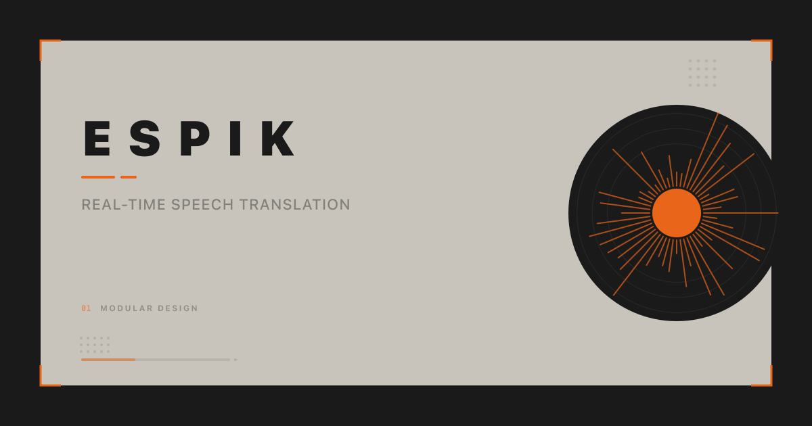

<h1 align="center">
  Espik
</h1>

<p align="center">
  Real-Time Speech Translation
  <br />
  <br />
  <a href="https://espik.crafter.run">Website</a>
  ·
  <a href="https://github.com/crafter-station/espik/issues">Issues</a>
</p>

<p align="center">
  <a href="https://nextjs.org">
    
  </a>
  <a href="https://reactjs.org">
    
  </a>
  <a href="https://www.typescriptlang.org">
    
  </a>
  <a href="https://tailwindcss.com">
    
  </a>
</p>

<br />

## About

Espik translates speech in real time. Speak in one language, get your words transcribed and translated instantly. Built as a clean, focused web app — no installs, no friction.

## Features

- **Live Transcription** — See your words appear as you speak
- **Instant Translation** — Powered by [Palabra AI](https://github.com/palabra-ai/translator) for fast, accurate results
- **Language Swap** — Switch source and target languages in one tap
- **Copy to Clipboard** — Grab your transcript or translation with a click
- **Guided Onboarding** — Interactive spotlight tour for first-time users
- **Mobile-First** — Designed for phones, works everywhere

## Getting Started

```bash
# Clone
git clone https://github.com/crafter-station/espik.git
cd espik

# Install
bun install

# Run
bun dev
```

Open [http://localhost:3000](http://localhost:3000) to start translating.

## Stack

| Layer | Technology |
|-------|-----------|
| Framework | [Next.js 16](https://nextjs.org) |
| Language | [TypeScript](https://typescriptlang.org) |
| Styling | [Tailwind CSS 4](https://tailwindcss.com) |
| Translation | [@palabra-ai/translator](https://github.com/palabra-ai/translator) |
| Icons | [Lucide](https://lucide.dev) |

---

<p align="center">
  <sub>
    Built by
    <a href="https://crafterstation.com">
      Crafter Station
    </a>
  </sub>
</p>
